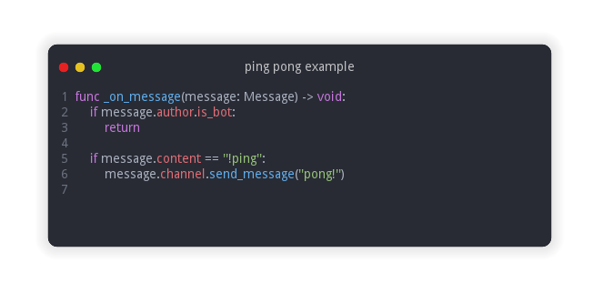

> :information_source: **Note:** If you are looking to integrate your game with the Discord client, check out [Discord RPC](https://github.com/Abdera7mane/Discord-RPC-GDScript).

# Cordot

<p align="center">
    Discord API wrapper for <a href="https://github.com/godotengine/godot">Godot Engine</a> written in <b>GDScript</b> language.
    
    <br>
    <a href="https://godotengine.org/download">
        
    </a>
    <a href="https://discord.com/developers/docs/reference">
        
    </a>
    <a href="LICENSE">
        
    </a>
</p>

# Features

* Object oriented
* Statically typed
* Supports gateway resumes and auto reconnects when possible

## Example

A minimal bot written using this library

```gdscript
extends Node

var token: String = "bot_token"
var client: DiscordClient = DiscordClient.new(token)

func _ready() -> void:
    add_child(client)
    
    client.connect("client_ready", self, "_on_bot_ready")
    client.connect("message_sent", self, "_on_message")

    client.login()

func _on_bot_ready(user: User) -> void:
    print("Bot is ready !")
    print("logged as: ", user.get_tag())

    var presence := PresenceUpdate.new()
    presence.set_status(Presence.Status.DND)\
            .add_activity(Presence.playing("Godot Engine"))

    client.update_presence(presence)

func _on_message(message: Message) -> void:
    if message.author.is_bot:
        return

    if message.content.to_lower().begins_with("hello"):
        message.channel.send_message("Greetings !")

```

## Installation


```
git clone --recursive https://github/Abdera7mane/cordot.git
cd cordot
git submodule update --init --recursive
```
Open the folder as a Godot project or copy the `addons` directory to an existing project.

## Documentation

Not available, there will be one after publishing a usable release of the library

## Usage

Even though this may seem useless for a Godot game, I find this project being useful in some scenarios:
* Learning resource
* Running a discord bot in a Godot game server

It is always up to you and your creativity on how you will use this project as long as you **don't abuse the Discord API**.
